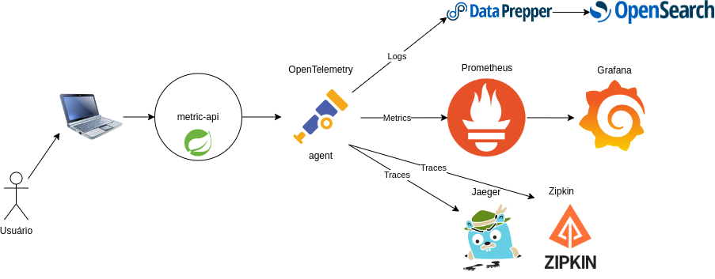

# Metrics API

Projeto que tem como objetivo realizar o estudo de instrumentação de um projeto spring com o opentelemetry

# Tecnologias usadas

- Spring Boot
- MySql
- OpenTelemetry
- Jaeger
- Prometheus
- Grafana
- Data Prepper
- OpenSearch
- Kafka
- Kafka UI
- Docker
- Docker Compose

# Arquitetura

# Como subir o ambiente
Abra o terminal na pasta `docker`

- Subir o ambiente

> docker compose up -d --build

**Atenção:** Ao subir o ambiente certifique-se de ter ao menos 4Gb de memória RAM livre.

- Derrubar o ambiente

> docker compose down --remove-orphans

# Referências

- [OpenTemetry](https://opentelemetry.io/docs/)
- [Jaeger](https://www.jaegertracing.io/docs/1.48/getting-started/)
- [Prometheus](https://prometheus.io/docs/introduction/overview/)
- [Grafana](https://grafana.com/docs/grafana/latest/)
- [Data Prepper](https://opensearch.org/docs/latest/data-prepper/index/)
- [OpenSearch](https://opensearch.org/docs/latest/)
- [OpenTelemetry Collector Contrib (GitHub)](https://github.com/open-telemetry/opentelemetry-collector-contrib)
- [Data Prepper (GitHub)](https://github.com/opensearch-project/data-prepper)